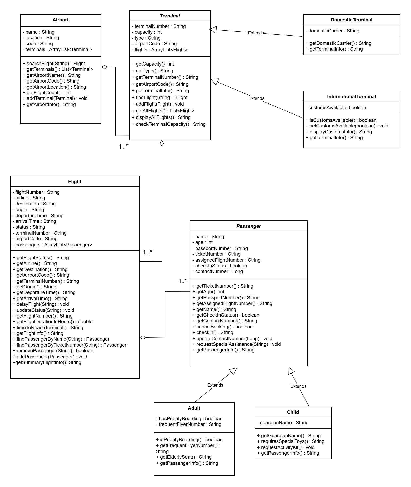

# Flight Information Assistant

## Overview
AirportBuddy Helpy is an Object-Oriented Java program designed to help passengers both Adults and Children access their flight details and relevant travel information efficiently. The application provides a user-friendly interface to retrieve essential flight data.

## Features
- **Flight Lookup**: Search for flight details using flight number, airline, destination, location and even more!
- **Passenger Information**: View and go through check-in status, flight cancellation process, flight assignment, and boarding time.
- **Weather & Airport Info**: Get real-time flight status checks.
- **Selective Filtering**: Allows you to filter through terminals and flights according to the airport that you are going to!

## Technologies Used
- Java (Object-Oriented Programming principles)

## UML Diagram

## Code Output

Hello! Welcome to AirTravel Buddy! I'm Helpy! Your personal travel buddy!

[Image of airplane]

Please choose your airport or choose to view all:

1| By Code

2| By Name

3| View all airports!

4| Exit
Enter your choice: 1

Enter airport code: YYZ
Hello Passenger! Your airport details are the follows:
Toronto Pearson International Airport (YYZ) - "6301 Silver Dart Dr, Mississauga, ON L5P 1B2"

Helpy is here to help you! Here is the Airport Menu:
1. Find Flight by Flight Number
2. List all terminals
3. List all flights
4. Go Back to Previous Menu

[Image of helpy]

Hey! Helpy here again! Please choose an option: 2
 _____________________________________

 List of Terminals taken by Helpy:
 _____________________________________
Terminal 1, Capacity: 500, type: Domestic, Terminal operates carrier: Air Canada, Terminal has available capacity.        
Terminal 2, Capacity: 650, type: Domestic, Terminal operates carrier: WestJet, Terminal has available capacity.
Terminal 3, Capacity: 400, type: Domestic, Terminal operates carrier: Porter Airlines, Terminal has available capacity.   
Terminal 4, Capacity: 800, type: International, Customs Available: Yes, Terminal has available capacity.
Terminal 5, Capacity: 700, type: International, Customs Available: Yes, Terminal has available capacity.
Terminal 6, Capacity: 550, type: International, Customs Available: Yes, Terminal has available capacity.
Hello Passenger! Your airport details are the follows:
Toronto Pearson International Airport (YYZ) - "6301 Silver Dart Dr, Mississauga, ON L5P 1B2"

Helpy is here to help you! Here is the Airport Menu:
1. Find Flight by Flight Number
2. List all terminals
3. List all flights
4. Go Back to Previous Menu

[Image of helpy]

Hey! Helpy here again! Please choose an option: 3
 ______________________________________________________

 List of flights from all terminals taken by Helpy:
 ______________________________________________________
Hey Passenger! Here are the flights in Terminal: 1
Flight number 1
Flight Number: AC101 Origin: Toronto Destination: Vancouver Departure Time: 08:00 Arrival Time: 10:30
Flight number 2
Flight Number: WS210 Origin: Toronto Destination: Winnipeg Departure Time: 13:15 Arrival Time: 15:45
Flight number 3
Flight Number: LH401 Origin: Toronto Destination: Frankfurt Departure Time: 18:00 Arrival Time: 07:00+1

Hey Passenger! Here are the flights in Terminal: 2
Flight number 4
Flight Number: WS205 Origin: Toronto Destination: Calgary Departure Time: 09:15 Arrival Time: 11:45
Flight number 5
Flight Number: PD308 Origin: Toronto Destination: Ottawa Departure Time: 14:00 Arrival Time: 15:00
Flight number 6
Flight Number: BA093 Origin: Toronto Destination: London Departure Time: 19:30 Arrival Time: 07:00+1

Hey Passenger! Here are the flights in Terminal: 3
Flight number 7
Flight Number: PD302 Origin: Toronto Destination: Montreal Departure Time: 10:00 Arrival Time: 11:00
Flight number 8
Flight Number: WS220 Origin: Toronto Destination: Regina Departure Time: 15:30 Arrival Time: 18:00
Flight number 9
Flight Number: TS501 Origin: Toronto Destination: Cancun Departure Time: 20:00 Arrival Time: 23:30

Hey Passenger! Here are the flights in Terminal: 4
Flight number 10
Flight Number: AC115 Origin: Toronto Destination: Halifax Departure Time: 11:30 Arrival Time: 14:30
Flight number 11
Flight Number: AC130 Origin: Toronto Destination: Chicago Departure Time: 16:00 Arrival Time: 17:30
Flight number 12
Flight Number: WG715 Origin: Toronto Destination: Punta Cana Departure Time: 21:15 Arrival Time: 01:45

Hey Passenger! Here are the flights in Terminal: 5
Flight number 13
Flight Number: AC120 Origin: Toronto Destination: New York Departure Time: 12:00 Arrival Time: 13:30
Flight number 14
Flight Number: AC801 Origin: Toronto Destination: New York Departure Time: 16:00 Arrival Time: 17:30

Hey Passenger! Here are the flights in Terminal: 6
Flight number 15
Flight Number: AC105 Origin: Toronto Destination: Edmonton Departure Time: 12:00 Arrival Time: 14:45
Flight number 16
Flight Number: UA310 Origin: Toronto Destination: Chicago Departure Time: 17:15 Arrival Time: 18:45

Hello Passenger! Your airport details are the follows:
Toronto Pearson International Airport (YYZ) - "6301 Silver Dart Dr, Mississauga, ON L5P 1B2"

Helpy is here to help you! Here is the Airport Menu:
1. Find Flight by Flight Number
2. List all terminals
3. List all flights
4. Go Back to Previous Menu

[Image of helpy]

Hey! Helpy here again! Please choose an option: 1
Helpy asks you to enter your flight code:
AC101

Flight Help Options for flight number (AC101):
1. Show Flight Details
2. Find Passenger By Ticket Number
3. Go Back
Please choose an option: 1
========================
Your Flight Details
========================
Flight Number: AC101
Origin: Toronto
Destination: Vancouver
Departure Time: 08:00
Arrival Time: 10:30
Flight Duration (Hours): 2.5
Make sure to return at least 2 hours before your flight's departure time: 08:00
========================

Flight Help Options for flight number (AC101):
1. Show Flight Details
2. Find Passenger By Ticket Number
3. Go Back
Please choose an option: 2
Dear Passenger, Please enter your ticket number:
1010 

Passenger Help Options for passenger name (Dave Cheng - 29):
1. Cancel Booking
2. Check In
3. Check Flight Status
4. Update Passenger Contact Info
5. Request special assistance
6. Passenger Info
7. Go Back
Please choose an option: 2
Checked in for flight AC101

Passenger Help Options for passenger name (Dave Cheng - 29):
1. Cancel Booking
2. Check In
3. Check Flight Status
4. Update Passenger Contact Info
5. Request special assistance
6. Passenger Info
7. Go Back
Please choose an option: 3
Flight AC101 status is On Time

Passenger Help Options for passenger name (Dave Cheng - 29):
1. Cancel Booking
2. Check In
3. Check Flight Status
4. Update Passenger Contact Info
5. Request special assistance
6. Passenger Info
7. Go Back
Please choose an option: 6
Name: Dave Cheng
Passport Number: JJ012345
Flight Number: AC101
Ticket Number: 1010
Check-in Status: true
Contact Number: 0

Passenger Help Options for passenger name (Dave Cheng - 29):
1. Cancel Booking
2. Check In
3. Check Flight Status
4. Update Passenger Contact Info
5. Request special assistance
6. Passenger Info
7. Go Back
Please choose an option: 4
Dear Passenger, Helpy asks you to enter your new contact number:
4162301726
Helpy has added your contact info! Yippee!

Passenger Help Options for passenger name (Dave Cheng - 29):
1. Cancel Booking
2. Check In
3. Check Flight Status
4. Update Passenger Contact Info
5. Request special assistance
6. Passenger Info
7. Go Back
Please choose an option: 6
Name: Dave Cheng
Passport Number: JJ012345
Flight Number: AC101
Ticket Number: 1010
Check-in Status: true
Contact Number: 4162301726

Passenger Help Options for passenger name (Dave Cheng - 29):
1. Cancel Booking
2. Check In
3. Check Flight Status
4. Update Passenger Contact Info
5. Request special assistance
6. Passenger Info
7. Go Back
Please choose an option: 7
Returning to previous menu

Flight Help Options for flight number (AC101):
1. Show Flight Details
2. Find Passenger By Ticket Number
3. Go Back
Please choose an option: 3
Returning to previous menu
Hello Passenger! Your airport details are the follows:
Toronto Pearson International Airport (YYZ) - "6301 Silver Dart Dr, Mississauga, ON L5P 1B2"

Helpy is here to help you! Here is the Airport Menu:
1. Find Flight by Flight Number
2. List all terminals
3. List all flights
4. Go Back to Previous Menu

[Image of helpy]

Hey! Helpy here again! Please choose an option: 4
Okay, Helpy will return you to previous menu
Please choose your airport or choose to view all:
1| By Code
2| By Name
3| View all airports!
4| Exit
Enter your choice: 4
Thank you for using AirTravel Buddy! - Helpy